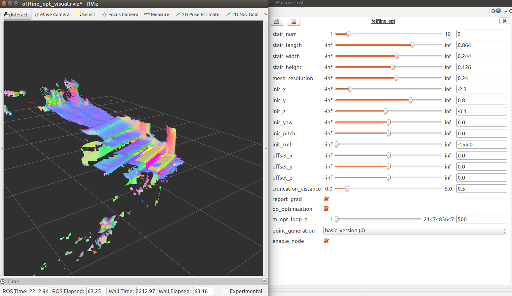
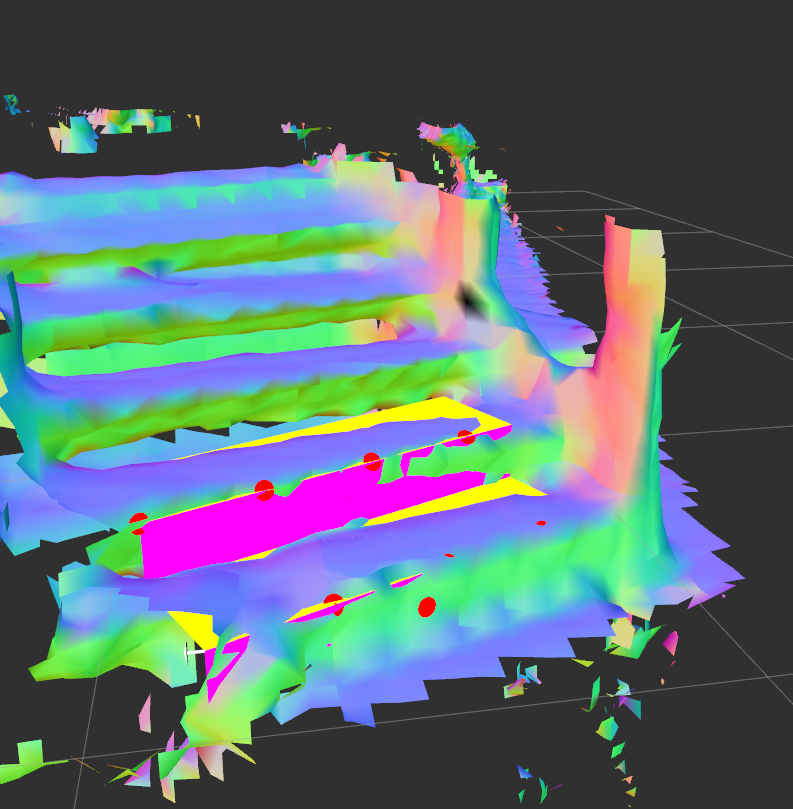

# Installation
 1. Copy  files to ROS_PATH/catkin_ws

 2. cd to catkin_ws/src

 3. in terminal run 
    
```bash
      	$ catkin build voxblox_ros stair_detection
```

# Run the demo

```bash
		$ roslaunch stair_complete offline_opt.launch 
```
In the panel click "*Enable Node*" to enable optimization of node.

Change the configuration, the optimization node in the back-end will automatically adjust the new configuration and optimize it.




# How to use the package 

Here is a "data analyze" demo. 

```bash
		$ roslaunch stair_complete data_analysis.launch 
```

It read the different configuration saved in the corresponding .csv file and save the result in "result.csv" file.

1. Dynamic Reconfigure service 

   The feature, dynamic reconfigure, is actually also implemented a special ROSService. It is not difficult to directly use C++ API to call the service. Just write a client and then write as follows:

   ```C++
   stair_complete::offline_dyn_paraConfig config;
   client.setConfiguration(config);
   //C++
   ```
   ```Python
   client.update_configuration({"init_x":3.5, "init_y":1.2})
   #PYTHON
   ```
   For further more information about dynamic reconfigure, refer this [short tutorial](http://wiki.ros.org/dynamic_reconfigure/Tutorials). 

   

2. Code API

   Mainly two classes are used: *Stair_Complete*,  *Stair_Optimizer*.

   *Stair_Optimizer* uses Ceres-Solver to optimize the problem.

   *Stair_Complete* wraps *Stair_Optimizer* and features like loading tsdf layer, generating meshgrid.  

   

   ```
   Stair_Interpolater4Ceres stair_interpolator4ceres;
   stair_interpolator4ceres.set_interpolator(&interpolator);
   StairOptimizer stair_optimizer(mesh_rotated, 
                               &stair_interpolator4ceres, st_init_pos);
   stair_optimizer.opt_epoc(500);
   ```
   
   The information is saved in *stair_optimizer.opt_record*.  




​    
​    
​    
